<div align="center">


# SAT-SA

### Supervisory Analytics Tool for SOC Assessment

**Find the security operations centres that only look good on paper.**

[](https://www.python.org/)
[](https://fastapi.tiangolo.com/)
[](https://duckdb.org/)
[](https://react.dev/)
[](#air-gapped-installation)
[](LICENSE)
[](#)

[Why](#why-sat-sa) · [How it works](#how-it-works) · [Detectors](#what-it-detects) · [Results](#results) · [Quick start](#quick-start) · [Using it](#using-sat-sa) · [Docs](#documentation)

</div>

<br />

<picture>
  <source media="(prefers-color-scheme: dark)" srcset="web/src/assets/landing/queue-dark.jpg" />
  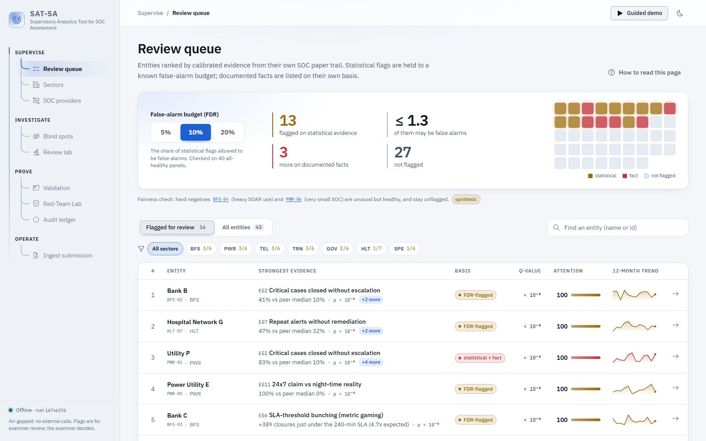
</picture>

<p align="center"><sub>The supervisory queue on the seeded demo panel (synthetic data). Statistical flags are held to a known false-alarm budget; documented facts are listed on their own basis.</sub></p>

---

## Why SAT-SA

Critical Sector Entities (banks, power utilities, telecoms, hospitals and others) already send their regulator a **SOC paper trail**: alerts, cases, workflow events, escalations and asset inventory. Reading it by hand doesn't scale, and the metrics in it can be gamed.

SAT-SA is an **offline, regulator-side** tool built for PS **SIH26157 (NTRO / NCIIPC)**. It reads that paper trail and looks for two kinds of weakness:

| | **Execution gaps** | **Negative space** |
|---|---|---|
| The question | *Was the work really done?* | *What evidence should exist but doesn't?* |
| Example | Critical alerts closed in minutes, with no escalation and copy-pasted notes | A critical server that has gone silent; an ATT&CK tactic the SOC cannot see at all |
| How it shows up | Unusual rates, timings and text compared with peers and with the entity's own history | Missing telemetry, missing records, decaying detection rules, red-team techniques that were never alerted on |

It then tells examiners **which entities, findings and cases to review first**, with a **known, controlled false-alarm rate**. Every flag carries:

- its **evidence** (record ids, down to the case timeline);
- a **calibrated p-value** or a **documented fact**;
- the **regulatory obligation** it tests (SEBI CSCRF, CERT-In 2022 Directions, RBI, CEA).

> [!IMPORTANT]
> SAT-SA raises **flags for examiner review**. It never decides on its own. Every examiner decision goes into a tamper-evident ledger, and nothing leaves the machine.

---

## How it works

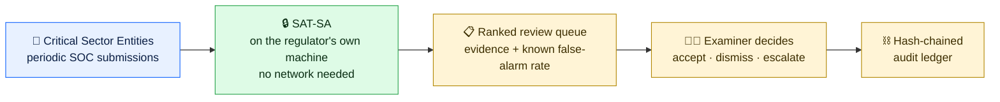

Under the hood, one pass of the analysis looks like this:

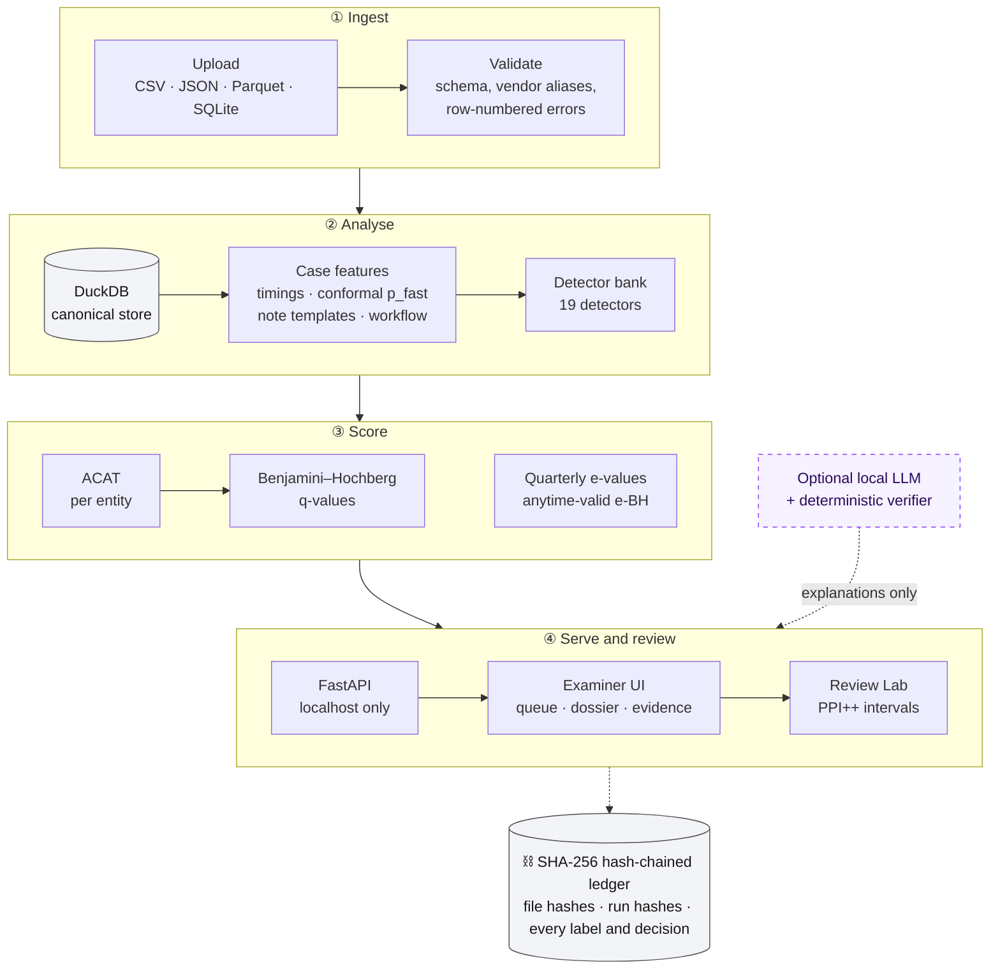

---

## What it detects

Nineteen detectors, one per weakness, each mapped to the problem statement's use cases and to a regulatory obligation. **Statistical** detectors return a calibrated p-value. **Fact** detectors return a documented severity and are never mixed into the statistics.

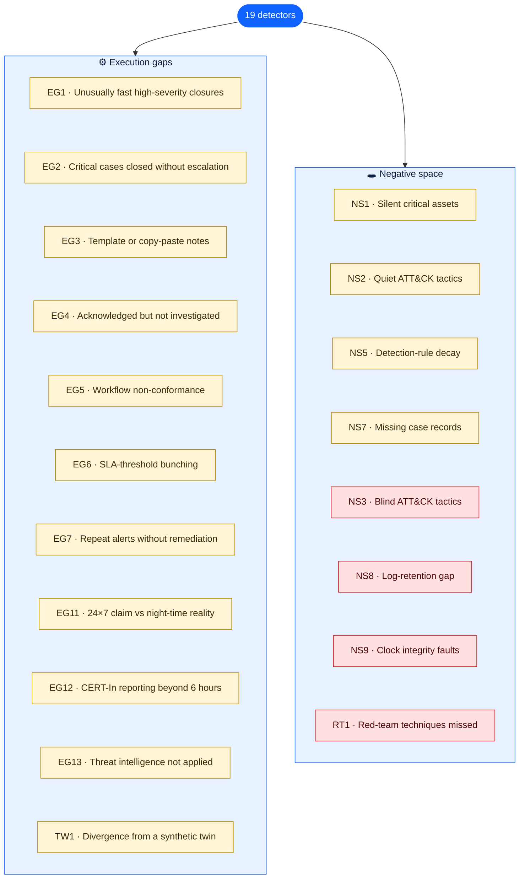

<sub>🟨 statistical: returns a calibrated p-value  ·  🟥 fact: returns a documented severity</sub>

| PS use case | Detector(s) | Method |
|---|---|---|
| (i) High-severity alerts closed unusually quickly | EG1, EG4 | Leave-one-entity-out conformal p-value per case → beta-binomial vs peers |
| (ii) Repeat alerts without remediation | EG7 | The same rule fires again as a true positive on the same asset within 14 days → beta-binomial |
| (iii) Critical alerts closed without escalation | EG2, EG5 | Case-mix-standardised rate test; declarative workflow conformance |
| (iv) Critical systems with little or no telemetry | NS1 | Negative-binomial silence vs peer asset classes and the asset's own history |
| (v) Deviations from peers | all statistical detectors, TW1 | Robust peer baselines; synthetic-control twin with placebo inference |
| (vi) Missing monitoring coverage | NS2, NS3 | Log-source → ATT&CK supportability: *quiet* (visible but absent) vs *blind* (cannot see) |
| (vii) Repetitive notes suggesting superficial review | EG3 | Near-duplicate clustering (char n-gram cosine) |
| (viii) Meeting metrics without managing risk | EG6, EG11 | SLA **bunching estimator** with a random-effects null; 24×7 claim vs night-time reality |
| (ix) Workloads inconsistent with expected activity | NS5, NS7, NS8, NS9 | Detection-rule decay ("exclusion ratchet"), missing case records, retention gaps, clock faults |
| Additional signals | EG12, EG13, RT1, provider lens, e-values | CERT-In 6-hour reporting; threat intel not applied; red-team known-positive misses; systemic MSSP effect; anytime-valid monitoring |

### How an entity gets its score

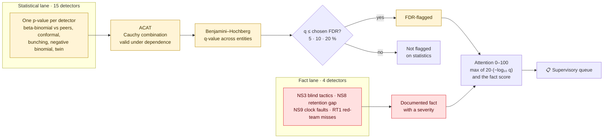

Why this design:

- **ACAT** combines an entity's evidence without assuming the detectors are independent (they aren't).
- **Benjamini–Hochberg** turns that into a queue where, of the entities flagged at 10% FDR, at most about 10% are expected to be false alarms. The examiner chooses the budget.
- **Anytime-valid e-values** let the regulator re-test every quarter without false alarms piling up.
- **Calibration rules** (robust over-dispersion, finite-peer variance inflation, mid-p for discrete counts) were each validated on panels where every entity is healthy. The history is in [`docs/CALIBRATION_LOG.md`](docs/CALIBRATION_LOG.md).

---

## Results

> [!NOTE]
> Numbers marked **synthetic** come from seeded panels with a hidden answer key. Numbers marked **real** come from [Microsoft GUIDE](https://arxiv.org/abs/2407.09017): 1.03M triage-graded incidents from 6,115 real organisations (CDLA-Permissive-2.0), including the expert queue rankings released with it (Freitas et al., 2026). Every number is produced by one command (see [Reproduce the validation](#reproduce-the-validation)) and is shown on the **Validation** page.

**Real SOC queues: does SAT-SA put the incidents experts care about first?**

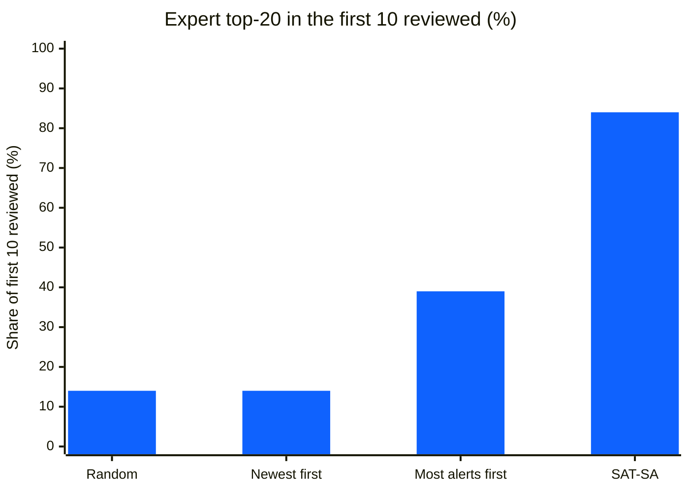

**Re-testing healthy entities every quarter: do false alarms pile up?**

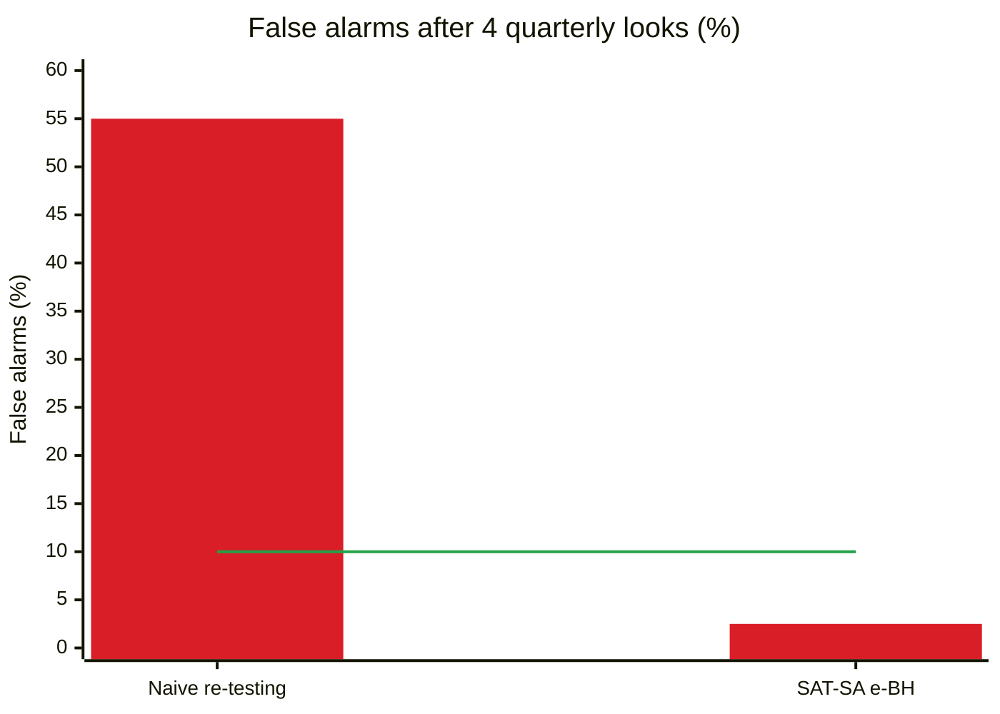
<sub>The line is the promised 10% budget.</sub>

**Can a SOC game a fixed audit schedule? (behaves well only in audit months)**

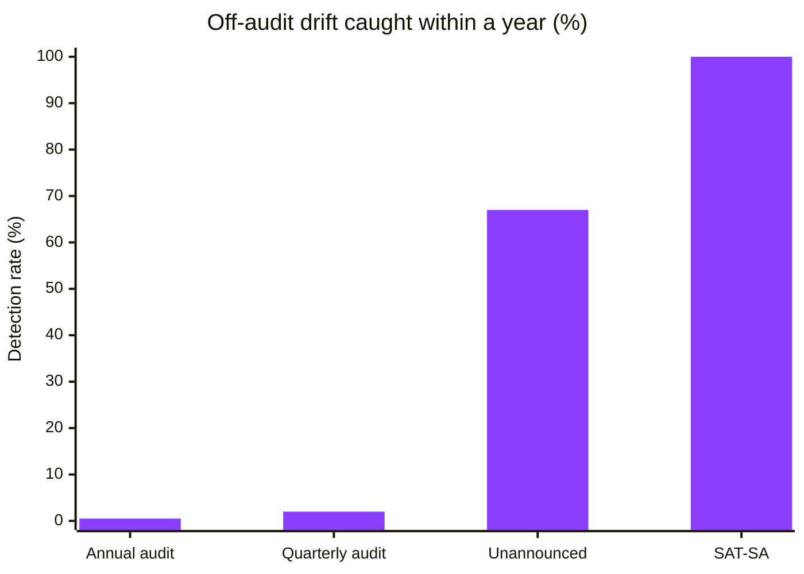

### Everything at a glance

| What we measured | Result | Data |
|---|---|---|
| Planted weaknesses recovered (5 independently seeded panels, 14 weakness types) | **100%** at 10% FDR; **0** hard negatives and **0** healthy entities flagged | synthetic |
| False alarms on 40 panels where every entity is healthy (promise: ≤ 10%) | **5%** realised (95% CI 0.6–17%) | synthetic |
| Re-testing the same healthy entities every quarter (40 panels, 4 looks) | naive re-testing: **55%** false alarms; SAT-SA anytime-valid e-BH: **2.5%** | synthetic |
| Superficially handled cases found per 100 examiner reviews | **55** with SAT-SA vs **7** with random sampling | synthetic |
| Examiner labels saved by prediction-powered inference, at equal confidence | **69%** at 30 labels, coverage 99% (target 90%) | synthetic |
| Expert top-20 incidents among the first 10 reviewed, in 499 real SOC queues | **84%** SAT-SA vs **14%** random, **39%** "most alerts first" | **real** |
| False alarms on 1,286 real organisations re-split at random (nothing changed) | **5%** of runs at 10% FDR | **real** |
| A silently suppressed alert category in real orgs | **92%** caught at **93%** precision | **real** + planted |
| PPI interval coverage on real analyst verdicts | **98%**, 41% fewer labels | **real** |
| Gaming: a SOC that behaves well only in audit months | fixed audits catch it **0.5–2%** of the time; SAT-SA catches it **100%** | synthetic simulation |
| Full analysis of 453k alerts / 215k cases / 1.4M workflow events | **~3 min**, 1.3 GB RAM, CPU only; API p95 < 70 ms | dev laptop |

---

## A look inside

<table>
  <tr>
    <td width="50%">
      <picture>
        <source media="(prefers-color-scheme: dark)" srcset="web/src/assets/landing/dossier-dark.jpg" />
        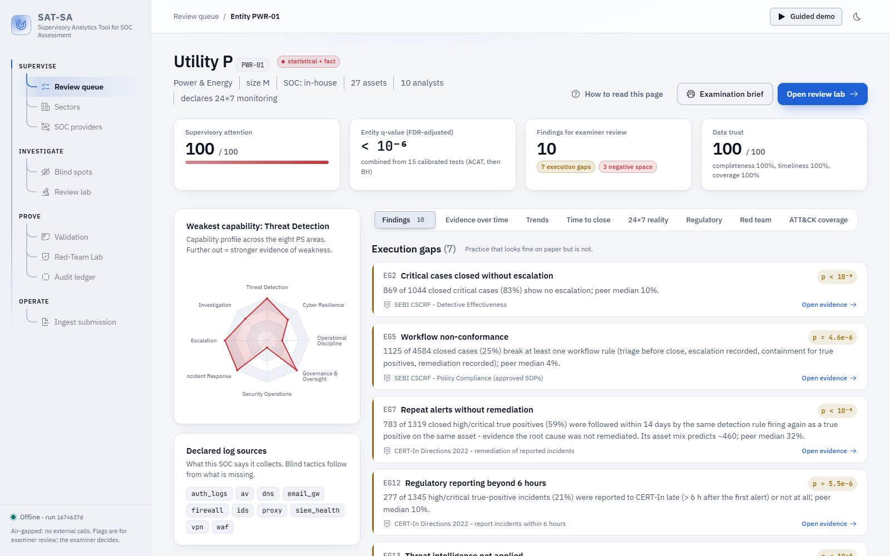
      </picture>
      <p align="center"><b>Entity dossier</b><br/><sub>Capability profile, findings with evidence and the regulation each one tests</sub></p>
    </td>
    <td width="50%">
      <picture>
        <source media="(prefers-color-scheme: dark)" srcset="web/src/assets/landing/bunching-dark.jpg" />
        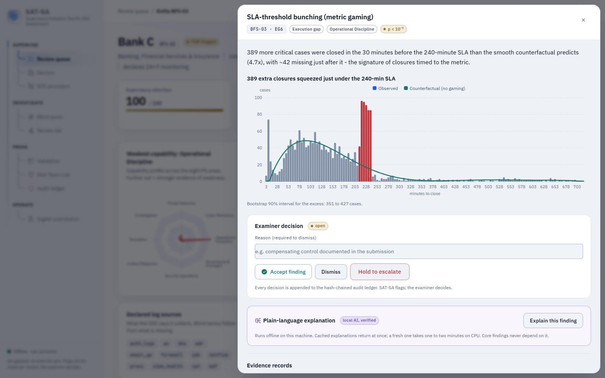
      </picture>
      <p align="center"><b>Evidence drawer</b><br/><sub>389 closures squeezed just under a 240-minute SLA, against the no-gaming counterfactual</sub></p>
    </td>
  </tr>
  <tr>
    <td width="50%">
      <picture>
        <source media="(prefers-color-scheme: dark)" srcset="web/src/assets/landing/guide-dark.jpg" />
        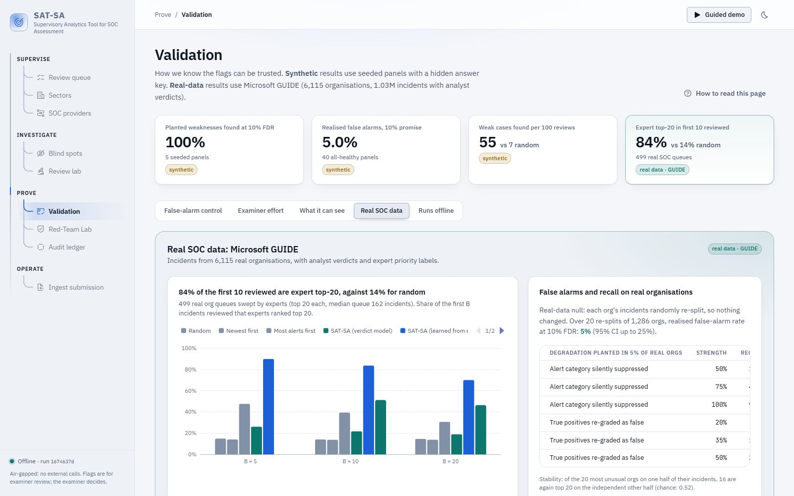
      </picture>
      <p align="center"><b>Validation</b><br/><sub>Calibration on healthy panels and results on real SOC data</sub></p>
    </td>
    <td width="50%">
      <picture>
        <source media="(prefers-color-scheme: dark)" srcset="web/src/assets/landing/redteam-dark.jpg" />
        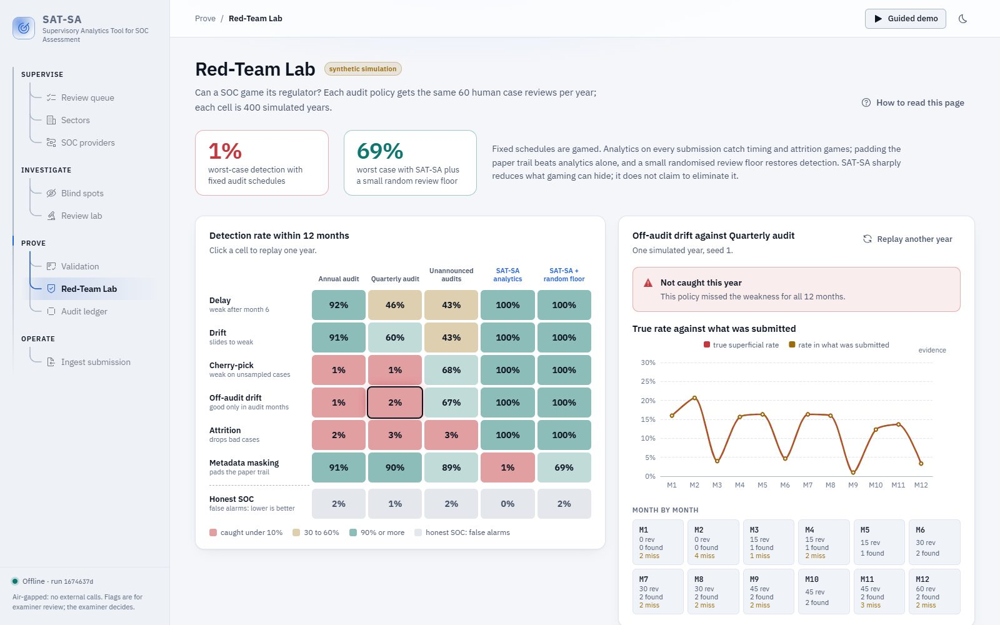
      </picture>
      <p align="center"><b>Red-Team Lab</b><br/><sub>Seven gaming strategies against five audit policies</sub></p>
    </td>
  </tr>
</table>

<sub>All screenshots show the seeded demo panel (synthetic data).</sub>

---

## Quick start

> [!TIP]
> The web UI is pre-built and served by the API, so you don't need Node.js to run SAT-SA.

### Windows: one click

```bat
run.bat
```

Then open **http://localhost:8000**.

- The first run creates a virtual environment, installs the dependencies, generates the 42-entity demo panel and runs the analysis (about 5 minutes).
- Later runs start in seconds.
- Needs Python 3.11+ (the reference build is Python 3.13).

### Any OS: manual

```bash
python -m venv .venv && . .venv/bin/activate        # Windows: .venv\Scripts\activate
pip install -r requirements.txt
python -m satsa.pipeline                             # generate the demo panel + analyse (~3 min) -> data/satsa.duckdb
python -m uvicorn satsa.api.main:app --port 8000     # UI + API on http://localhost:8000
```

The interactive API reference is at **http://localhost:8000/docs**; the contract is written up in [`docs/API.md`](docs/API.md) with sample responses in [`docs/api-examples/`](docs/api-examples/).

### Docker

The demo panel and its analysis are built into the image.

```bash
docker build -t satsa .                  # ~6 min, needs internet once
docker run --rm -p 8000:8000 satsa       # ready immediately on http://localhost:8000
```

- The container needs no network at run time. With `docker run --network none`, the full API still answers from inside the container, and the results match the Windows build exactly.
- The image does not include the optional local model; explanations use the verified template path.

### Air-gapped installation

1. On a connected machine, run `prepare_offline.bat`. It downloads all wheels to `wheelhouse\` (about 130 MB), the optional local model and a SHA-256 manifest.
2. Copy the folder to the target machine.
3. Run `install_offline.bat` there, then `run.bat`.

Use the **same Python minor version** on both machines: wheels are version-specific, and the reference build is Python 3.13, locked in `requirements.lock`. No network access is used at install or run time; `tests/test_offline.py` runs the analysis with every outbound connection blocked.

### Optional: local AI explanations

- Run `pip install -r requirements-ai.txt`, then place `Qwen3-4B-Instruct-2507-Q4_K_M.gguf` (Apache-2.0, 2.5 GB) in `data/models/`. `prepare_offline.bat` does both.
- The model only drafts plain-language explanations. A deterministic verifier keeps a claim only if it is grounded in the cited records (see [Built to be trusted](#built-to-be-trusted)).
- Without the model, SAT-SA uses template explanations and everything else is unchanged.
- `python -m satsa.ai.warm` pre-generates explanations for the top findings. Each takes about 1–2 minutes on a 4-core CPU.

### Optional: a hosted click-through demo

The frontend can also be built as a static site that reads a snapshot of real API responses, for hosts like Vercel or Netlify. It never saves anything. See [`web/DEPLOY.md`](web/DEPLOY.md).

---

## Using SAT-SA

The UI is organised the way an examination runs: **Supervise → Investigate → Prove → Operate**. A **Guided demo** button in the top bar walks through it.

| Area | Page | What it's for |
|---|---|---|
| **Supervise** | Overview | Entity map, priority list, findings and systemic risk at a glance |
| | Review queue | Entities ranked by calibrated evidence. The FDR slider (5 / 10 / 20%) sets how many false alarms you accept |
| | Sectors | Flagged entities, recurring weaknesses and blind tactics per critical sector |
| | SOC providers | Outsourced SOCs whose clients share a weakness, for example one weak MSSP serving 7 entities in 4 sectors |
| **Investigate** | Entity dossier | Findings with reasons, evidence and regulations; evidence over time, time-to-close survival, the 24×7 reality heatmap, red-team reconciliation, and a printable **examination brief** that answers SEBI CSCRF SOC-efficacy questions from evidence |
| | Evidence drawer | The chart behind each finding, every underlying record down to the case timeline, and **accept / dismiss / escalate** |
| | Blind spots | ATT&CK tactics each entity cannot see at all |
| | Review Lab | Blind-first case review with prediction-powered confidence intervals |
| **Prove** | Validation | Calibration on healthy panels and results on real SOC data |
| | Red-Team Lab | Can a SOC game its regulator? Seven gaming strategies against five audit policies |
| | Audit ledger | Every run, upload, label and decision in a SHA-256 hash chain, with a tamper demo |
| **Operate** | Ingest submission | Validate and commit a periodic submission, then re-run the analysis |

### An examiner's path through a finding

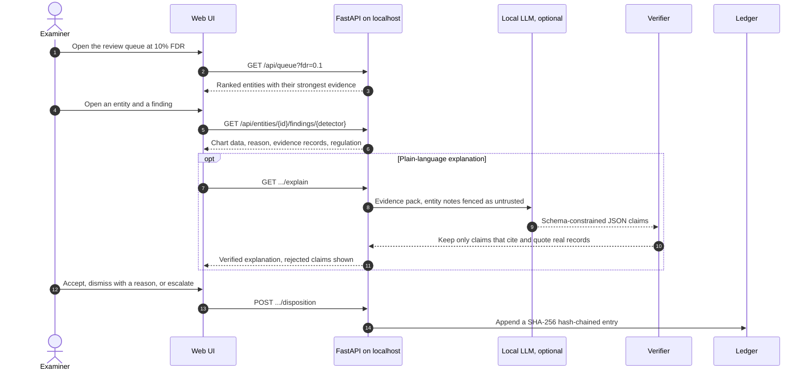

### Review Lab: fewer labels, honest intervals

Examiners can only read a handful of cases. The Review Lab makes those reviews count twice: once to confirm findings, and once to estimate how much superficial handling there really is.

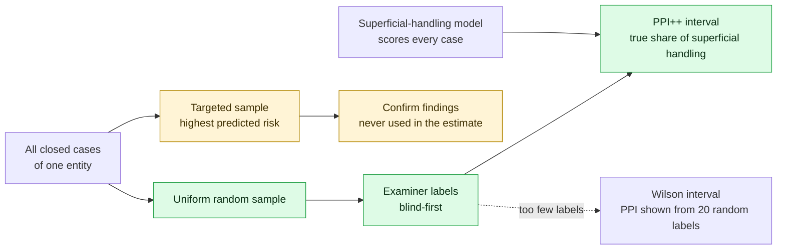

The interval stays valid even if the model is poor; a good model just makes it narrower. On real analyst verdicts it covered the truth 98% of the time with 41% fewer labels.

---

## Bring your own data

Upload a periodic submission as one file per table, or one SQLite / JSON file containing several. Column names are normalised, and common vendor spellings are mapped (`AlertId`, `Rule ID`, `Hostname`, `Priority`, `created_at`, …).

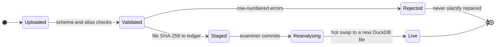

| Table | Required columns |
|---|---|
| entities | entity_id, entity_name, sector |
| assets | asset_id, entity_id, asset_class, criticality |
| alerts | alert_id, entity_id, asset_id, ts, category, severity, detector_id |
| cases | case_id, entity_id, alert_id, severity, opened_ts, ack_ts, closed_ts, escalated, notes |
| case_events | case_id, ts, activity |
| escalations | case_id, entity_id, ts, to_level |
| submissions | submission_id, entity_id, period, due_ts, received_ts |
| redteam (optional) | entity_id, category (or technique_id), target_asset, start_ts |

- Optional columns improve specific detectors: `disposition`, `remediated`, `ioc_enriched`, `auto_closed`, `analyst_id` and `declared_log_sources`.
- Try [`data/samples/broken/`](data/samples/broken/) (rejected with row-numbered errors) and [`data/samples/submission/`](data/samples/submission/) (new entity HLT-07, flagged after commit).

---

## Built to be trusted

**Every action is ledgered.** Each run, upload, label and decision is appended to a SHA-256 hash chain. Changing any past entry breaks every link after it, which `POST /api/ledger/verify` detects. The tamper demo edits a copy only.

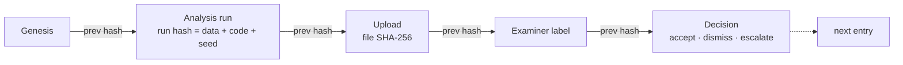

**The AI is on a short leash.** The optional local model never flags anyone and core findings never depend on it.

- Output is schema-constrained JSON, then checked by a deterministic `verify()`.
- Every claim must cite records in the evidence pack, quote them verbatim and use only numbers that appear there.
- Claims that try to clear the entity are rejected.
- Notes written by the entity are fenced as untrusted, and instruction-like text in them is flagged and never used as evidence.

**The predictor only targets reviews.** The superficial-handling model is a readable logistic regression on 11 case features. It picks review samples and powers the PPI estimate; it never raises a flag.

---

## Reproduce the validation

```bash
python -m satsa.eval.run_all            # synthetic suite -> reports/validation.json (~1 h on 4 cores; cached, resumable)
python -m satsa.guide.aggregate         # once: GUIDE CSVs -> data/guide/agg (~5 min)
python -m satsa.guide.experiments       # real-data suite -> reports/guide.json (~18 min)
python -m pytest tests -q               # unit, offline and end-to-end tests
```

- The committed results are in [`reports/validation.json`](reports/validation.json) and [`reports/guide.json`](reports/guide.json).
- GUIDE is not redistributed. Download it from Kaggle (`Microsoft/microsoft-security-incident-prediction`) into `data/guide/`.
- The seeded panel's answer key is written to `data/generated/_truth/`. The API never exposes it, except to the demo-only "simulated examiner".

<details>
<summary><b>Other useful commands</b></summary>

```bash
python -m satsa.gen.generator           # regenerate the synthetic panel (~90 s) -> data/generated/
python -m satsa.eval.quickcheck         # detector -log10(p) matrix + ranking vs the answer key
python -m satsa.eval.gaming             # print the Red-Team Lab detection matrix
python -m satsa.gen.samples             # rebuild data/samples/ (valid, broken, red-team)
python -m satsa.reset_demo              # clear labels, dispositions and ingested runs (API stopped)
cd web && npm install && npm run dev    # frontend dev server, proxies /api to :8000
cd web && npm run build                 # rebuild the UI into satsa/api/static
```

On Windows, set `PYTHONIOENCODING=utf-8`. DuckDB holds an exclusive file lock, so stop the API before running the pipeline or the eval scripts.

</details>

---

## Honest limitations

- **Headline detection numbers are synthetic.** Real-data results use GUIDE, which has analyst verdicts and expert queue ranks but no ground-truth "weak SOC" labels. So real-data recall is measured by planting degradations into real organisations.
- **Real organisations differ a great deal.** Peer comparison alone flags few real orgs at 10% FDR (the flags it does raise are stable across independent halves). SAT-SA's power there comes from **self-history** and **case-level evidence**, not raw peer ranking.
- **Subtle weaknesses have limits.** A 10% SLA-gaming share, or an escalation rate of 85% against 93%, is caught only some of the time. The power curves on the Validation page show exactly where.
- **Padding the paper trail defeats any metadata analytics.** SAT-SA's defence is the randomised review floor, which catches it 69% of the time within a year in the simulator.
- **Local explanations are slow and optional.** They take 1–2 minutes each on a laptop CPU, and findings never depend on them.
- **Out of scope:** real-time monitoring, live SIEM ingestion, and acting as a SOC.

---

## Repository layout

```
satsa/
├── gen/          seeded synthetic panel (42 entities, 7 NCIIPC sectors, 12 months) + sample submissions
├── ingest/       validation of uploaded submissions
├── detect/       19 detectors (one row per entity each)
├── stats/        calibrated tests, ACAT, BH / e-BH, PPI++, random-effects nulls
├── ai/           verifier-gated local explanations
├── eval/         validation suite and Red-Team Lab simulator
├── guide/        Microsoft GUIDE real-data experiments
├── api/          FastAPI server (serves the built UI from satsa/api/static)
├── pipeline.py   features -> detectors -> scores -> DuckDB (+ ledger)
├── workflow.py   submission commit, dispositions, red-team upload, sector view
├── review.py     Review Lab sampling and PPI++
├── ledger.py     append-only SHA-256 hash chain
└── brief.py      printable examination brief
web/              React 19 + TypeScript + IBM Carbon + ECharts UI
docs/             architecture (+ PDF), API contract and examples, calibration log
reports/          committed validation results
data/samples/     example uploads: valid, broken and red-team
tests/            unit, offline and end-to-end tests
```

**Tech stack:** Python (FastAPI, DuckDB, pandas, NumPy, SciPy, scikit-learn, lifelines) · React 19, TypeScript, Vite, IBM Carbon, ECharts · optional llama.cpp with a 4-bit GGUF model.

## Documentation

| Document | What's in it |
|---|---|
| [`docs/ARCHITECTURE.md`](docs/ARCHITECTURE.md) ([PDF](docs/ARCHITECTURE.pdf)) | Two-page solution architecture: functional design, methods, AI components, data requirements |
| [`docs/API.md`](docs/API.md) | The HTTP contract, with sample responses in [`docs/api-examples/`](docs/api-examples/) |
| [`docs/CALIBRATION_LOG.md`](docs/CALIBRATION_LOG.md) | Every statistical fix that was tried, with its numbers, including what failed and why |
| [`web/DEPLOY.md`](web/DEPLOY.md) | Building and hosting the static click-through demo |

## Licence

SAT-SA is released under the [Apache License 2.0](LICENSE). You may use, modify and redistribute it, including in commercial or government tools, provided you keep the licence and copyright notices and state any significant changes. The licence also grants a patent licence from contributors.

Copyright 2026 the SAT-SA authors.

## Third-party licences and credits

- **Python dependencies:** permissive only (MIT / BSD / Apache-2.0): FastAPI, DuckDB, pandas, NumPy, SciPy, scikit-learn, lifelines, psutil, llama-cpp-python (optional). No GPL or AGPL code; conformance checking and bunching are implemented from scratch.
- **Model:** Qwen3-4B-Instruct-2507, Apache-2.0 (optional, not included).
- **Data:** Microsoft GUIDE, CDLA-Permissive-2.0 (not redistributed).
- **Methods:**
  - Benjamini & Hochberg (1995); Liu & Xie (2020, ACAT); Wang & Ramdas (2022, e-BH).
  - Angelopoulos et al. (2023, prediction-powered inference and PPI++).
  - Chetty et al. (2011) and Kleven (2016) for bunching; Abadie et al. (2010) for synthetic control; Efron (2004) for the empirical null.

<div align="center">
<br />
<sub>Built for <b>Smart India Hackathon 2026</b> · Problem statement <b>SIH26157</b> (NTRO / NCIIPC)</sub>
</div>
